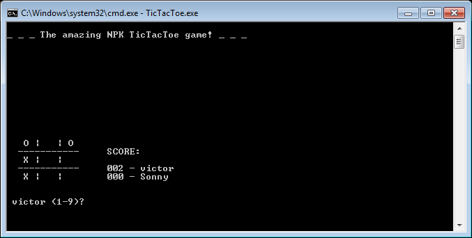

# The amazing NPK TicTacToe game!

Well, in fact it's just yet another console based Tic-tac-toe game. It started as a simple C++ exercise, both for fun and learning purposes.

It uses some Windows specific code, so the easiest way to compile it is to use Visual Studio. Unfortunately, this version will not compile in other operating systems.

This game, which is based in one of the most popular paper-and-pencil games in the world, is pretty much self-explanatory, as it includes a brief onboarding text containing the rules.

You may choose to play against a human friend (sitting next to you and using the same computer) or against some very ~smart~ basic A.I. opponents.
